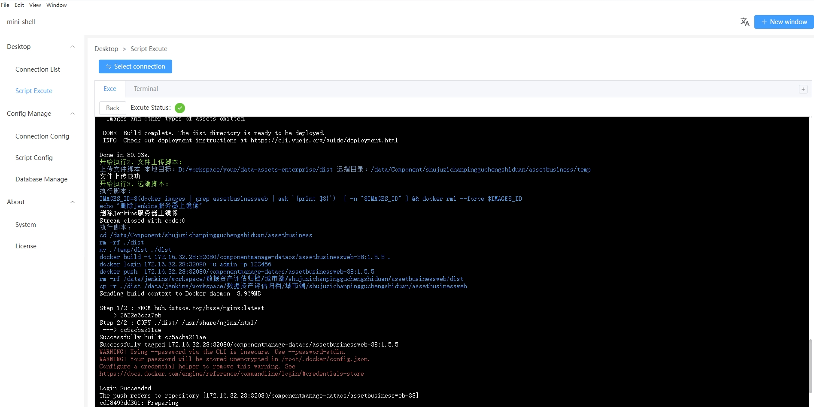

# Description
This is a tool that can configured shell and executed on both local and remote Linux servers. It is primarily used for automated deployments. To a certain extent, can replace Jenkins.

# Usage
### Create Scripts
Create scripts in the "Script Configuration Management" section. You can create three types of scripts:

- Remote Scripts
Remote scripts that can be executed after SSH connecting to a remote Linux server.

- Local Scripts
Scripts that can be executed on the local machine, including PowerShell, bat, and native scripts.

- File Upload Scripts
Used to upload local folders or files to a remote SSH-connected Linux server.

- Combined scripts
Run other scripts you set, multiple scripts can be running simultaneously.

### Create Server Connection Configurations
Create the necessary SSH connections to Linux servers in the "Connection Configuration" section, including information such as username, password, port, etc.

### Execute Scripts
Select the server to connect to in the "Script Execute" section and choose the script to execute.
The generated logs is displayed in the image below.

# Comparison with Jenkins
### Advantages
- mini-shell is a local tool with the server running locally, eliminating the need for remote server support.

- It can execute local scripts, providing stronger controllability.

- Configurations can be freely exported and imported without the need for usernames and passwords.

- Its size is small size, it doesn't occupy server resources when locally packaged.

### Disadvantages
- It lacks the robust ecosystem that Jenkins possesses.

- Scripts execute will be end if quit the application.

# Language Settings
The mini-shell comes with built-in support for Chinese and English, with Chinese being the default. If you want to support additional languages, you can follow these steps:

- Translate the language files located in the locales directory within the source code. If translating into Japanese, rename the translated file to ja.json. The naming convention can be found [here](https://element-plus.org/en-US/guide/i18n.html).

- Start the app, select the language pack in system settings, then restart the app for it to take effect.
