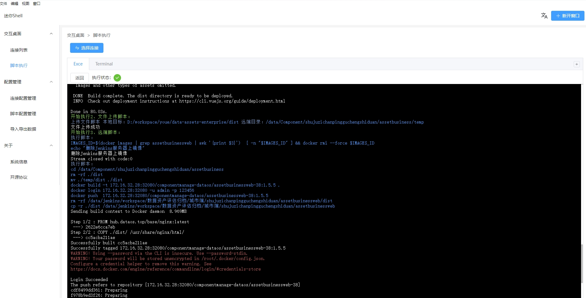

# 说明
这是一个可以在设置脚本，在本地和远程linux服务器上执行的工具，主要用于自动化部署，一定程度上可以替代jenkins。
# 用法

### 新建脚本
在“脚本配置管理”中创建脚本，您可以创建三种类型的脚本

- 远程脚本
在SSH连接到远程linux服务器后可以执行的远程脚本

- 本地脚本
可以执行本地机器执行的脚本，包括powershell，bat，以及原生脚本

- 文件上传脚本
用于将本地的文件夹或者文件上传到远程SSH连接的linux服务器

- 组合脚本
运行你设置的其他脚本，多个脚本可以同时运行

### 新建服务器连接配置
在“连接配置管理”中创建需要SSH连接的linux服务器，包括用户名、密码、端口等信息

### 执行脚本
在“脚本执行”中选择要连接的服务器，并选择要执行的脚本进行执行
生成的日志如图所示

# 对比jenkins

### 优点

- mini-shell是一个本地工具，服务端在本地，无需远程服务器支持

- 可以执行本地脚本，比如本地打包，可控性更强

- 可以随意导出导入配置，无需账号密码

- 体积小，本地打包不占用服务器资源

### 不足点

- 没有那么jenkins那样完善的生态

- 关闭界面后脚本将会终止执行
